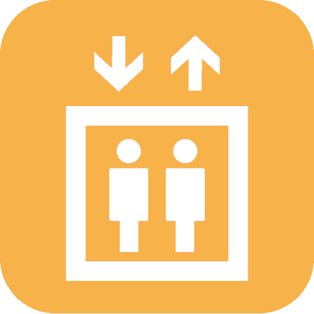

# LETS ELEVATOR - Elevator Simulator

<div align="center">
  
  <br>
  <strong>Play with your favorite elevator anytime, anywhere</strong>
  <br>
  <strong>Realistic elevator with only buttons operation</strong>
</div>

## 📱 Application Overview

LETS ELEVATOR is a simulator app that provides a realistic elevator operation experience. It offers various modes and customization options, making elevator operation learning fun and engaging.

### 🎯 Key Features

- **Realistic Elevator Operation**: Authentic elevator-like operation experience
- **Multiple Modes**: Normal mode, 1000 Buttons Challenge, Shimada mode
- **Customizable**: Button styles, backgrounds, floor number settings
- **Multi-language Support**: Japanese, English, Spanish, French, Korean, Chinese
- **Audio & Vibration Feedback**: Realistic operation feel
- **Google Play Games Integration**: Leaderboard functionality
- **Ad Support**: AdMob advertisement display

## 🚀 Technology Stack

### Frameworks & Libraries
- **Flutter**: 3.3.0+
- **Dart**: 2.18.0+
- **Riverpod**: State management
- **Firebase**: Analytics, App Check
- **Google Mobile Ads**: Advertisement display

### Core Features
- **Audio**: just_audio
- **Text-to-Speech**: flutter_tts
- **Vibration**: vibration
- **Localization**: flutter_localizations
- **Environment Variables**: flutter_dotenv
- **App Tracking Transparency**: app_tracking_transparency

## 📋 Prerequisites

- Flutter 3.3.0+
- Dart 2.18.0+
- Android Studio / VS Code
- Xcode (for iOS development)
- Firebase project (optional)

## 🛠️ Setup

### 1. Clone the Repository
```bash
git clone https://github.com/your-username/elevatorsimulator.git
cd elevatorsimulator
```

### 2. Install Dependencies
```bash
flutter pub get
```

### 3. Environment Variables Setup
Create `assets/.env` file and configure required environment variables:
```env
IOS_BANNER_UNIT_ID="your-ios-banner-id"
ANDROID_BANNER_UNIT_ID="your-android-banner-id"
# Other ad IDs...
IOS_INTERSTITIAL_UNIT_ID="your-ios-interstitial-id"
ANDROID_INTERSTITIAL_UNIT_ID="your-android-interstitial-id"
IOS_REWARDED_UNIT_ID="your-ios-rewarded-id"
ANDROID_REWARDED_UNIT_ID="your-android-rewarded-id"
```

### 4. Firebase Configuration (Optional)
If using Firebase:
1. Create a Firebase project
2. Place `google-services.json` (Android) and `GoogleService-Info.plist` (iOS)
3. These files are automatically excluded by .gitignore

### 5. Privacy & Compliance (iOS)
- App Tracking Transparency (ATT) is enabled. On first launch, iOS may prompt for tracking authorization.
- No additional setup is required beyond running the app on a real device.

### 6. Firebase App Check (Optional)
- App Check is activated in code (Android: Play Integrity, iOS: DeviceCheck in release; debug providers in debug builds).
- Ensure corresponding providers are enabled in your Firebase project for production builds.

### 7. Run the Application
```bash
# Android
flutter run

# iOS
flutter run -d ios
```

## 🎮 Application Structure

```
lib/
├── main.dart              # Application entry point
├── homepage.dart          # Main elevator simulator interface
├── menu.dart              # Main menu interface
├── buttons.dart           # 1000 Buttons Challenge page
├── settings.dart          # Settings page
├── audio_manager.dart     # Audio management
├── tts_manager.dart       # TTS management
├── games_manager.dart     # Game services management
├── floor_manager.dart     # Floor management
├── common_widget.dart     # Common widgets
├── constant.dart          # Constant definitions
├── extension.dart         # Extension functions
├── admob_banner.dart      # Banner advertisements
└── l10n/                  # Localization
    ├── app_en.arb
    ├── app_ja.arb
    ├── app_ko.arb
    ├── app_zh.arb
    ├── app_fr.arb
    └── app_es.arb

assets/
├── images/                # Image resources
│   ├── menu/             # Menu images
│   ├── normalMode/       # Normal mode images
│   ├── 1000Mode/         # 1000-floor mode images
│   ├── realOn/           # Real mode (lit)
│   ├── realOff/          # Real mode (unlit)
│   └── settings/         # Settings screen images
├── audios/               # Audio files
└── fonts/                # Font files
```

## 🎨 Customization

### Button Styles
- Shape: Round, Square
- Style: Multiple design patterns
- Background: Various background themes

### Floor Settings
- Normal Mode: Standard floor numbers
- 1000 Buttons Challenge: Speed challenge with large button grid
- Shimada Mode: Special configuration

## 🌐 Localization

- ARB files live in `lib/l10n/` (en, es, fr, ja, ko, zh)
- Configuration is managed by `l10n.yaml`
- Supported languages: English, Spanish, French, Japanese, Korean, Chinese
- To add a language:
  1. Create `app_xx.arb`
  2. Add locale to `supportedLocales` if needed
  3. Run `flutter pub get` and rebuild

## 📱 Supported Platforms

- **Android**: API 21+
- **iOS**: iOS 11.0+
- **Web**: Coming soon

## 🔧 Development

### Code Analysis
```bash
flutter analyze
```

### Run Tests
```bash
flutter test
```

### Build
```bash
# Android APK
flutter build apk

# Android App Bundle
flutter build appbundle

# iOS
flutter build ios
```

## 🔒 Security

This project includes security measures to protect sensitive information:
- Environment variables for API keys
- Firebase configuration files are excluded from version control
- Ad unit IDs are stored in environment files
- Keystore files are properly excluded

## 📄 License

This project is private and proprietary.

## 🤝 Contributing

Pull requests and issue reports are welcome.

## 📞 Support

If you have any problems or questions, please create an issue on GitHub.

## 🚀 Getting Started

For new developers:
1. Follow the setup instructions above
2. Check the application structure
3. Review the customization options
4. Start with the main.dart file to understand the app flow

---

<div align="center">
  <strong>LETS ELEVATOR</strong> - Experience the world of elevator!
</div>

## Licenses & Credits

This app uses the following open-source libraries:

- Flutter (BSD 3-Clause License)
- firebase_core, firebase_analytics, firebase_app_check (Apache License 2.0)
- google_mobile_ads (Apache License 2.0)
- shared_preferences (BSD 3-Clause License)
- flutter_dotenv (MIT License)
- flutter_tts (BSD 3-Clause License)
- just_audio (BSD 3-Clause License)
- vibration (MIT License)
- games_services (MIT License)
- hooks_riverpod, flutter_hooks (MIT License)
- url_launcher (BSD 3-Clause License)
- webview_flutter (BSD 3-Clause License)
- cupertino_icons (MIT License)
- flutter_launcher_icons (MIT License)
- flutter_native_splash (MIT License)
- intl (BSD 3-Clause License)
- flutter_localizations (BSD 3-Clause License)

For details of each license, please refer to [pub.dev](https://pub.dev/) or the LICENSE file in each repository.
