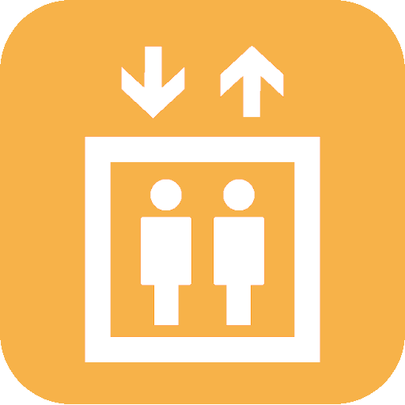

# LETS ELEVATOR - Elevator Simulator

<div align="center">
  
  <br>
  <strong>Play with your favorite elevator anytime, anywhere</strong>
  <br>
  <strong>Realistic elevator with only buttons operation</strong>
</div>

## 📱 Application Overview

LETS ELEVATOR is a Flutter app for Android and iOS that simulates operating an elevator.
It offers several modes and customization options for buttons, floors and backgrounds.

### 🎯 Key Features

- **Realistic Elevator Operation**: Authentic elevator-like operation experience
- **Multiple Modes**: Normal mode, 1000 Buttons Challenge, Shimada mode
- **Customizable**: Button shapes and styles, backgrounds, floor numbers and stops
- **Multi-language Support**: Japanese, English, Spanish, French, Korean, Chinese
- **Audio & Vibration Feedback**: Sounds, spoken announcements and haptics
- **Leaderboard**: Game Center and Google Play Games through `games_services`
- **Google Mobile Ads**: Banner ads and rewarded ads that unlock customization
- **In-app Purchase**: One-time premium unlock via RevenueCat
- **Firebase Integration**: Analytics

## 🚀 Technology Stack

### Frameworks & Libraries
- **Flutter**: 3.47.0+
- **Dart**: 3.13.0+
- **Firebase**: firebase_core, firebase_analytics
- **Google Mobile Ads**: google_mobile_ads
- **RevenueCat**: purchases_flutter
- **Game Services**: games_services

### Core Features
- **Audio**: just_audio
- **Text-to-Speech**: flutter_tts, vendored under `packages/flutter_tts`
- **Vibration**: vibration
- **State Management**: hooks_riverpod, flutter_hooks
- **Localization**: flutter_localizations, intl
- **Environment Variables**: flutter_dotenv
- **Storage**: shared_preferences
- **WebView**: webview_flutter
- **Links**: url_launcher

`flutter_tts` is a path dependency, not the pub.dev package.
The fork adds Swift Package Manager manifests and an Android Gradle Plugin 9 build, and `pubspec.yaml` records exactly what differs from the published 4.2.5.

## 📋 Prerequisites

- Flutter 3.47.0+ (required by Android Gradle Plugin 9: earlier versions force the Kotlin Gradle Plugin onto modules that AGP 9 compiles itself)
- Dart 3.13.0+
- Android Studio / Xcode
- A Firebase project (Analytics), since `main.dart` calls `Firebase.initializeApp` at startup
- A RevenueCat account for the premium purchase
- `firebase-tools` (`npm i -g firebase-tools`) and `flutterfire_cli` (`dart pub global activate flutterfire_cli`), then `firebase login`

## 🛠️ Setup

### 1. Clone the Repository
```bash
git clone https://github.com/fcb1899v/letselevator_flutter.git
cd letselevator_flutter
```

### 2. Install Dependencies
```bash
flutter pub get
```

### 3. Configuration Files Setup

**Environment variables.** Copy `assets/.env_example` to `assets/.env` and fill in the values.
The template lists every key with what it is for, and is the one place that list is maintained.
`pubspec.yaml` declares `assets/.env`, so the file has to exist or the build fails.
Debug builds use Google's demo ad units and need no real ids, and the demo unit for an inline adaptive request is not the same id as the fixed-size one.

**Android signing, release only.** Copy `android/key.properties.example` to `android/key.properties` and fill it in.
Nothing in it ships inside the app, and the two passwords are real secrets: together with the keystore they let anyone publish an update Play accepts as coming from you.
Keep the keystore outside the repository and back both up.
A release built without this file falls back to the debug signing config, which produces an artifact Play rejects.

### 4. Firebase Configuration

1. Create a Firebase project.
2. Run `flutterfire configure`.
   It writes the Android and iOS Firebase config files, `lib/firebase_options.dart` and `firebase.json`.
3. None of those files are in git.
   The Android build fails without the generated json, so a fresh clone has to run `flutterfire configure` before building.

### 5. Run the Application
```bash
# Android
flutter run -d <android-device-id>

# iOS (Swift Package Manager: there is no Podfile to install)
flutter run -d <ios-device-id>
```

## 🎮 Application Structure

```
lib/
├── main.dart                # Application entry point
├── homepage.dart            # Main elevator simulator interface
├── menu.dart                # Main menu interface
├── buttons.dart             # 1000 Buttons Challenge page
├── settings.dart            # Settings page
├── premium_page.dart        # Premium purchase page
├── purchase_manager.dart    # RevenueCat purchase and entitlement handling
├── plan_provider.dart       # Premium state provider
├── audio_manager.dart       # Audio management
├── tts_manager.dart         # TTS management
├── games_manager.dart       # Game services, sign-in and score submission
├── floor_manager.dart       # Floor management
├── analytics_manager.dart   # Firebase Analytics events
├── admob_banner.dart        # Banner advertisements
├── admob_interstitial.dart  # Interstitial advertisements (not in use)
├── admob_rewarded.dart      # Rewarded advertisements
├── common_widget.dart       # Common widgets
├── constant.dart            # Constant definitions
├── extension.dart           # Extension functions (UI, navigation, layout)
├── l10n_extension.dart      # Localization helpers, `part of extension.dart`
├── size_extension.dart      # Responsive layout size helpers, `part of extension.dart`
└── l10n/                    # Localization
    ├── app_en.arb
    ├── app_es.arb
    ├── app_fr.arb
    ├── app_ja.arb
    ├── app_ko.arb
    ├── app_zh.arb
    └── app_localizations*.dart   # Generated by flutter gen-l10n

assets/
├── images/                # Image resources
│   ├── common/           # Shared images
│   ├── menu/             # Menu images
│   ├── button/           # Button images
│   ├── normalMode/       # Normal mode images
│   ├── 1000Mode/         # Shimada mode artwork
│   ├── realOn/           # Real mode (lit)
│   ├── realOff/          # Real mode (unlit)
│   ├── real1000On/       # 1000 Buttons Challenge (lit)
│   ├── real1000Off/      # 1000 Buttons Challenge (unlit)
│   └── settings/         # Settings screen images
├── audios/               # Audio files
└── fonts/                # Font files
```

```
packages/
└── flutter_tts/          # Fork of the published flutter_tts, used through a path dependency
```

`lib/firebase_options.dart` is generated by `flutterfire configure` and is not in git.

## 🎨 Customization

### Button Styles
- Shape: nine entries in `buttonShapeList`, the first three free and the rest unlocked one at a time
- Style: multiple design patterns
- Background: `backgroundStyleList` holds metal, dark, plastic, wood, marble and old

### Floor Settings
- Normal Mode: standard floor numbers (`initialFloorNumbers`)
- 1000 Buttons Challenge: 30-second speed challenge on a large button grid
- Shimada Mode: special configuration
- Every button except 1F can be renumbered.
  The picker offers only the gap between the neighbouring buttons, inside B12..163F, so the panel always reads bottom to top.
  With sixteen buttons the top therefore stops at 12F and the bottom at B4
- Each button can be set to stop or to bypass, except 1F.
  At least one floor above 1F and one below it must stop, so the last remaining switch on a side is disabled
- Backgrounds unlock one at a time: the first two are free, each of the rest costs its own rewarded video
- Floors unlock one at a time as well.
  Above ground and below it are two independent orders (8F, 14F, 100F, 154F, R / B2, B7, B12), and each side offers its button only on the next one in its own order.
  One unlock covers both the floor number and the stop switch of that button
- Shimada mode keeps its own panel (`shimadaFloorNumbers`).
  It draws one artwork per floor from `assets/images/1000Mode/`, so it must not follow `initialFloorNumbers`.
  A mismatch shows up at runtime, not in `flutter analyze` or `flutter test`
- Button shapes unlock one shape at a time, and a best score of 100 in the 30-second challenge (`unlockAllBestScore`) opens every shape and the button style section at once

## 🏆 Launch and Leaderboard

- Sound, text to speech and Game Center initialise in the background after the first frame, so the first seconds are silent
- Sound and speech only play while the app is visible, and nothing is replayed when it comes back
- A score is submitted when a 30-second run finishes. A best that fails to send is kept and resent later

## 💳 Premium

A single non-consumable purchase, sold through RevenueCat.
The app checks the entitlement `letselevator_premium` (`premiumEntitlementID` in `lib/constant.dart`), which must match the RevenueCat dashboard.

- Removes the banner ad and opens every lock at once
- Reached from the PREMIUM tile in the menu, and from any padlock in settings.
  The padlock is the paid path; the Unlock button beside it is the free one
- Restoring is offered on the same page, as the store guidelines require

## 🌐 Localization

- ARB files live in `lib/l10n/` (en, es, fr, ja, ko, zh)
- Configuration is managed by `l10n.yaml`
- UI code reads strings through `context.xxx()`, defined in `lib/l10n_extension.dart` (a `part of` `lib/extension.dart`), instead of calling `AppLocalizations.of(context)!` directly
- Supported languages: English, Spanish, French, Japanese, Korean, Chinese
- To add a language:
  1. Create `app_xx.arb`
  2. Add the locale to `supportedLocales` if needed
  3. Run `flutter pub get` and rebuild

## 📱 Supported Platforms

- **Android**: API 24+ (`flutter.minSdkVersion`), compiled and targeted at API 37
- **iOS**: iOS 15.0+ (the Runner target's `IPHONEOS_DEPLOYMENT_TARGET`; the project-level value is 17.0)

## 🔧 Development

### Code Analysis
```bash
flutter analyze   # expected: No issues found!
```

### Run Tests
```bash
flutter test      # expected: All tests passed!
```

### Build
```bash
# Android APK
flutter build apk

# Android App Bundle
flutter build appbundle

# iOS
flutter build ios
```

## 📄 License

This project is not open source.
The source is published so that it can be read, and all rights are reserved.
See [LICENSE](LICENSE) for what that permits.
Third-party components keep their own licenses, listed below.

## 🤝 Contributing

Issue reports are welcome.
Pull requests are not accepted, because the code is not licensed for redistribution.

## 📞 Support

If you have any problems or questions, please create an issue on GitHub.

## Licenses & Credits

This app uses the following third-party components:

- Flutter (BSD 3-Clause License)
- firebase_core, firebase_analytics (BSD 3-Clause License)
- google_mobile_ads (Apache License 2.0)
- Google Mobile Ads Android SDK (Android Software Development Kit License): `play-services-ads`, pulled in by google_mobile_ads
- Google Mobile Ads iOS SDK (proprietary Google binary; its CocoaPods spec declares only a Google copyright notice, with no open-source license): `Google-Mobile-Ads-SDK`, pulled in by google_mobile_ads
- User Messaging Platform, the consent SDK (Android Software Development Kit License): `com.google.android.ump:user-messaging-platform`, pulled in by google_mobile_ads
- User Messaging Platform on iOS (proprietary Google binary, declared the same way as the iOS ads SDK): `GoogleUserMessagingPlatform`, pulled in by `Google-Mobile-Ads-SDK`
- purchases_flutter (MIT License)
- shared_preferences (BSD 3-Clause License)
- flutter_dotenv (MIT License)
- flutter_tts (MIT License)
- just_audio (MIT License), which bundles ExoPlayer on Android: `androidx.media3:media3-exoplayer` (Apache License 2.0)
- vibration (BSD 2-Clause License)
- games_services (MIT License)
- hooks_riverpod, flutter_hooks (MIT License)
- url_launcher (BSD 3-Clause License)
- webview_flutter (BSD 3-Clause License)
- cupertino_icons (MIT License)
- flutter_launcher_icons (MIT License)
- flutter_native_splash (MIT License)
- path (BSD 3-Clause License)
- intl (BSD 3-Clause License)
- flutter_localizations (BSD 3-Clause License)

For details of each license, please refer to [pub.dev](https://pub.dev/) or the LICENSE file in each repository.
